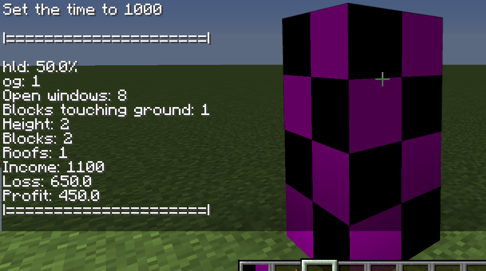
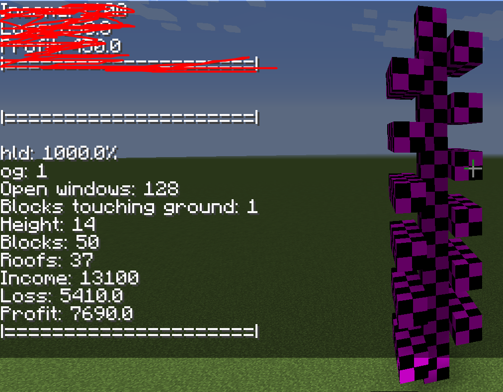

## Example 1

### Manually calculated:

```
------ Income
4W: 1 = 500$
4W, 1R: 1 = 600$
Total: 600$ + 500$ = 1100$
------ Loss
Blocks touching ground: 1 = 400$
Height: 2 = 50% of blocks touching ground loss = 200$
Windows: 8 = 5$ * 8 = 40$
Roofs: 1 = 10$
Total: 400$ + 200$ + 40$ + 10$ = 650$
------

Profit: 450$
    (1100$ - 650$)
```

### Automatically calculated:



## Example 2

### Manually calculated:

```
------ Income
4W: 1 = 500$
4W, 1F: 1 = 600$
3W: 12 = 250$ * 12 = 3000$
3W, 1F: 24 = 300$ * 24 = 7200$
1W, 1F: 12 = 150$ * 12 = 1800$
Total: 13100$
------ Loss
Blocks touching ground: 1 = 400$
Height: 14 = 1000% of blocks touching ground loss = 4000$
Windows: (4 * 2 + 3 * 36 + 1 * 12) = (8 + 108 + 12) = 128 * 5 = 640$
Roofs: (1 + 24 + 12) = 37 * 10 = 370$
Total: 5410$
------

Profit: 7,690$
	(13100$ - 5410$) 
```

### Automatically calculated:


